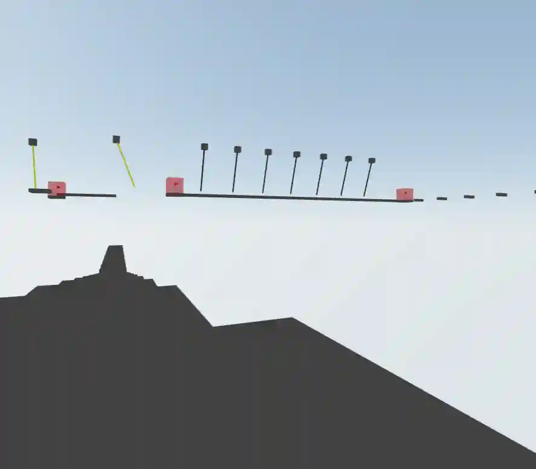

# Parkour

Parkour web game build with React Three Fiber and react-three/rapier.



## Getting Started

First, run the development server:

```bash
npm run dev
```

## Multiplayer

Aiming to have multiplayer via P2P and Websockets. Websocket backend code is not in this repo or available at this time. P2P code will be included here.

## Maps and editor

`data/levelMaps.js` exports an array of level objects with `mapName` and `mapObstacles`. Each component is stored as `{ id, component, props }`, including the player spawn and checkpoint flags. `props.position` uses world coordinates and `props.rotation` uses radians. Beginner contains the existing course; Intermediate, Advanced, and Expert each start with a player spawn and a platform.

Load an official map with `/play?map=Beginner` (or another map name). Turn on Debug Mode to access the map editor in the left panel, then toggle Edit mode. Gameplay pauses and OrbitControls replaces the player camera. Click a component or choose it from the list, move or rotate it with the handles, or edit its position, rotation, and component props. Rotation fields display degrees. You can also add and delete components; every map keeps one player spawn.

**Save map** saves built-in level edits to the persisted `useStore.levelMaps` array on this device. **Export levels** downloads the full level array as JSON for updating project data; browser saves do not rewrite the source file. Completed checkpoint IDs persist in `useStore.checkpointProgress` per map. Start is a spawn point and is excluded from the lobby's completed/total counters. Resetting checkpoints clears only the current map's progress.

**Build Map** under Submitted Maps opens `/play?map=Custom&edit=1`. Custom maps use the same editor, but their component array is stored as JSON in the `components` URL parameter. Adding, deleting, or editing a component updates the URL automatically, and **Copy map link** copies a playable link. Custom layouts are never saved into the built-in map array. Each distinct custom layout has separate checkpoint progress. Invalid component data displays a loading error rather than loading an official map.

Custom mode displays a URL capacity meter with a percentage and encoded size. It counts the entire browser URL, including the origin, path, and encoded query parameters, against [Chrome's 2 MiB limit](https://chromium.googlesource.com/chromium/src/+/main/url/url_constants.h) (`MAX_CUSTOM_MAP_URL_LENGTH` in `data/mapUtils.js`). The meter turns amber at 80% and red at 95%; edits that would exceed the limit are rejected before replacing the current map or URL. The existing 500-component limit is shown separately and includes the player spawn. Hosting and sharing services can reject links below Chrome's limit.

## Obstacles Guide

Obstacle components live in `components/Game/Obstacles`. Add them to a map's `mapObstacles` array or use the editor. Platform colors are repeatable using the component's ID as `obstacleKey` and its `colorSeed` prop.

| Obstacle                 | Description                                                                                                                                                            |
| ------------------------ | ---------------------------------------------------------------------------------------------------------------------------------------------------------------------- |
| **Platform**             | Fixed box platform for walking and landing. Set `args={[width, height, depth]}` to change its size.                                                                    |
| **SpinningPlatform**     | Rotates around its vertical axis and carries the player as they stand on it.                                                                                           |
| **DisappearingPlatform** | Disappears 2 seconds after the player lands, then returns 5 seconds later. Adjust `disappearAfter` and `respawnAfter`.                                                 |
| **GravityPlatform**      | Balances on a center pivot and tilts toward the player's offset until they slide off. Adjust `tiltSpeed`, `maxTilt`, and `returnSpeed`.                                |
| **RotatingLog**          | Rolling wooden cylinder with pegs distributed using a repeatable `seed`. Adjust `radius`, `length`, `rotationSpeed`, and `pegCount`; set `pegCount={0}` for no pegs.   |
| **SpringPlatform**       | Launches the player upward when they land on top. Adjust `force` to change the vertical launch speed.                                                                  |
| **RopeSwing**            | Swinging rope the player automatically grabs on contact, allowing them to climb and jump off. Edit mode shows direction arrows and two lines marking its swing limits. |
| **SwingingBall**         | Heavy ball suspended from a swinging rope that players must dodge.                                                                                                     |
| **Checkpoint**           | Sensor that unlocks a saved respawn location when the player enters it.                                                                                                |

For map building, enable Debug Mode and press **G** to toggle fly mode. This setting persists in the Zustand store. Fly with WASD or arrow keys, rise with Space, descend with C, and hold Shift to move faster.

## Attributions

[Parkour Icon](https://www.flaticon.com/free-icon/parkour_3163705)
